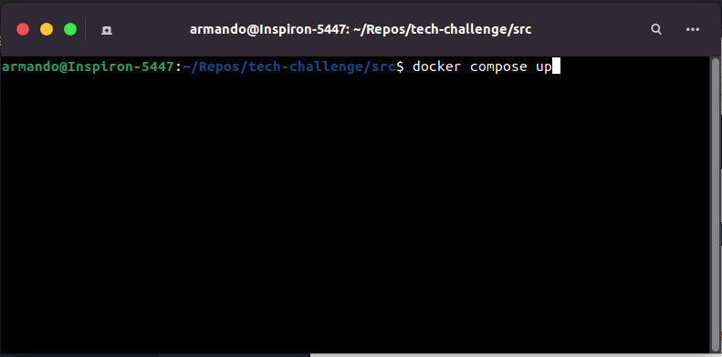
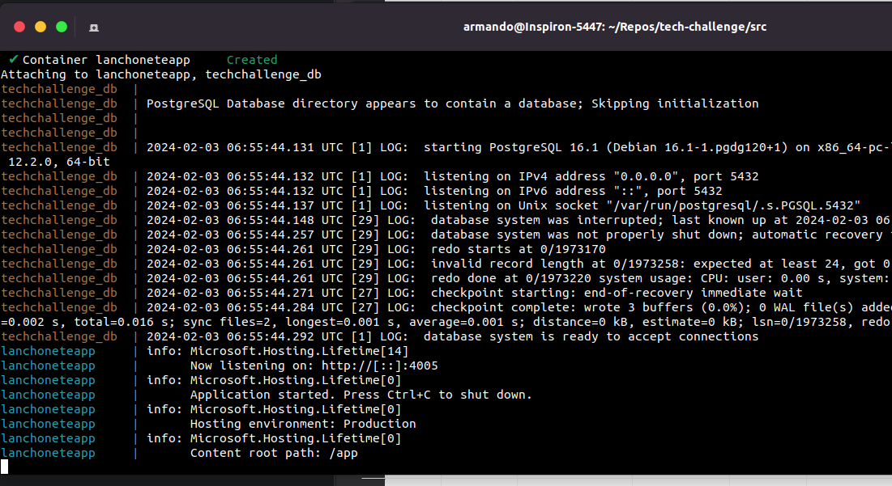
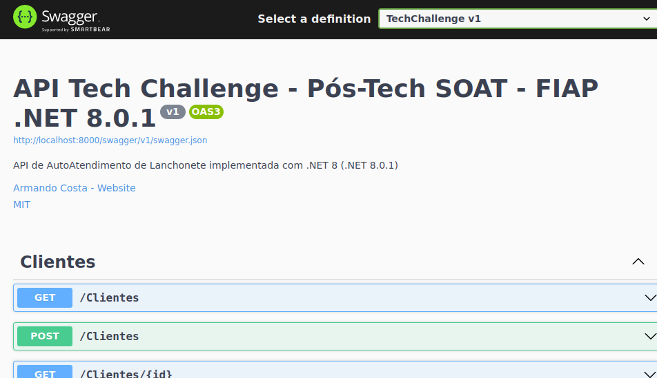
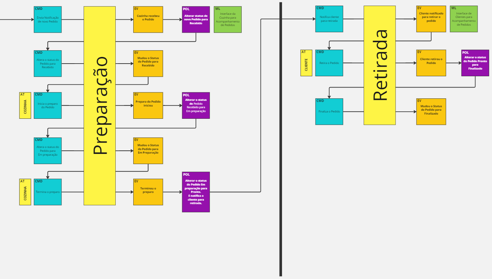
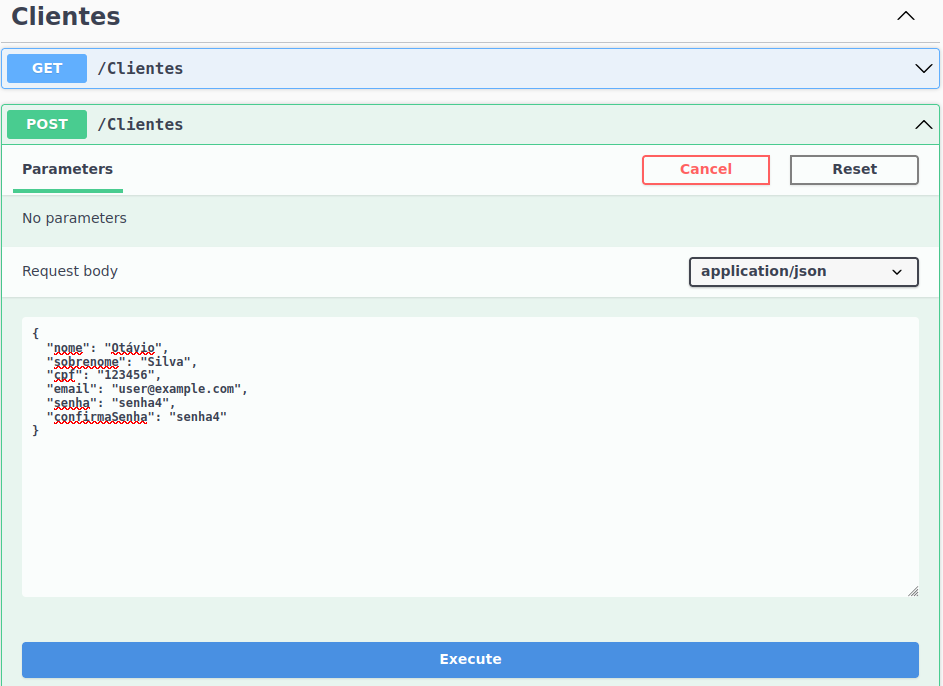
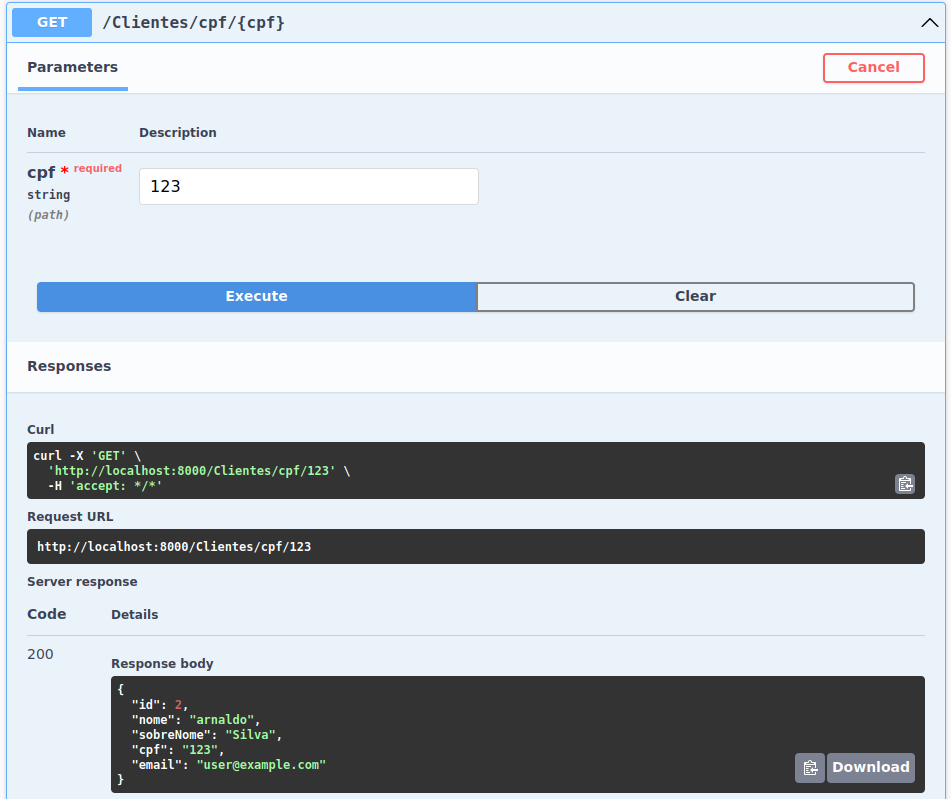
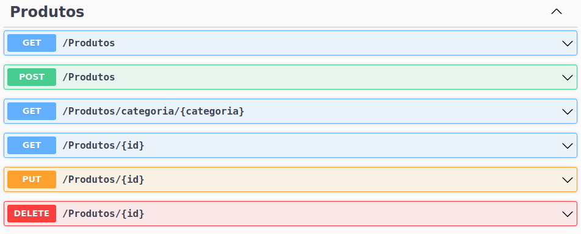
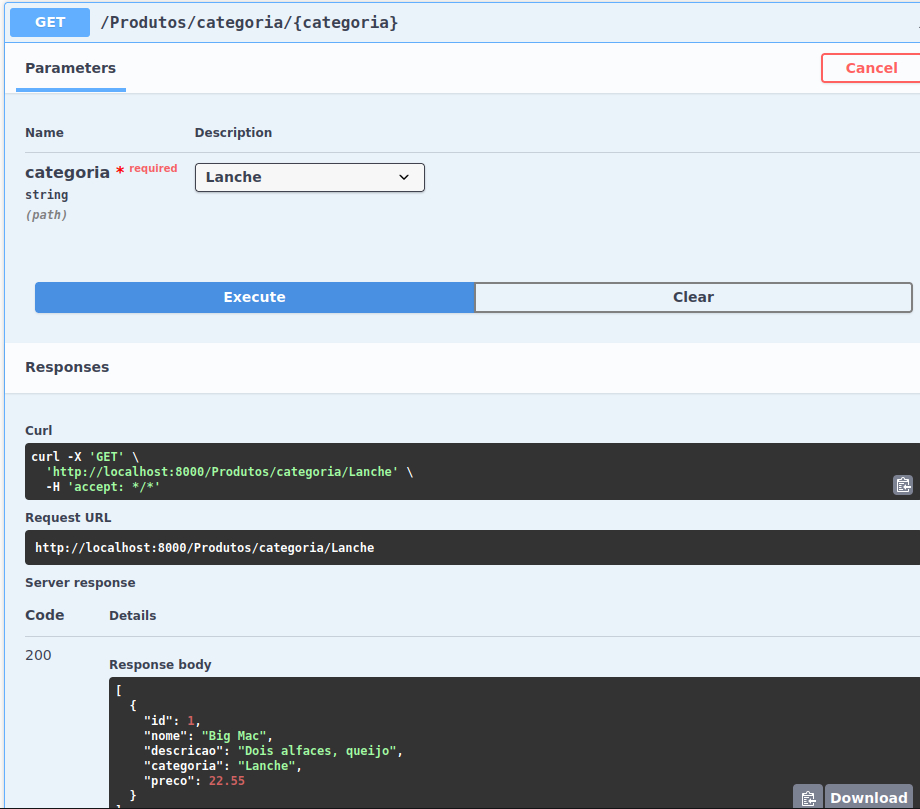
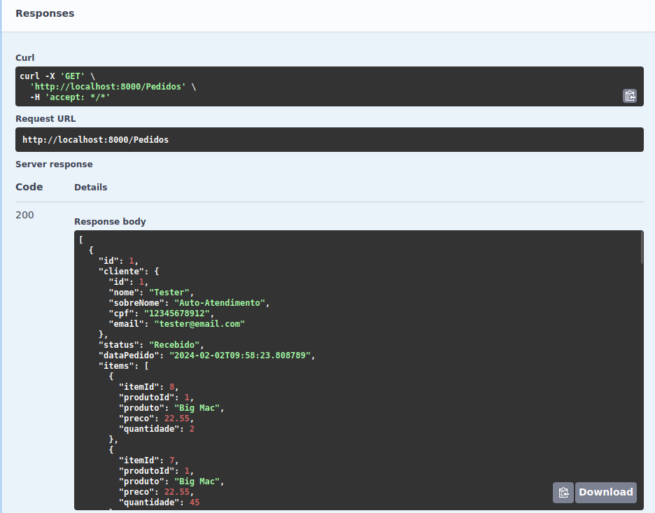

# Tech Challenge - Pós-Tech SOAT - FIAP

Este projeto foi desenvolvido durante o curso de pós-graduação em arquitetura de software da FIAP - turma 5SOAT.

Membros do grupo 32: Armando Ferreira Costa - RM 352815.

# Executar o projeto localmente

**Terminal:**
PASSO 01
```
git clone https://github.com/armandofc1/tech-challenge.git
cd tech-challenge/src
docker compose up
```



**Browser**
PASSO 02
```
http://localhost:4005/swagger
```


# Fase 01

**O PROBLEMA**

Há uma lanchonete de bairro que está expandindo devido seu grande sucesso. Porém, com a expansão e sem um sistema de controle de pedidos, o atendimento aos clientes pode ser caótico e confuso.

Para solucionar o problema, a lanchonete irá investir em um sistema de autoatendimento de fast food, que é composto por uma série de dispositivos e interfaces que permitem aos clientes selecionar e fazer pedidos sem precisar interagir com um atendente.                      

**Entregáveis da fase:**

## Entregável 01

Documentação do sistema (DDD)

**Linguagem Ubíqua:**
|Termo           |Descrição|
|----------------|-------------------------------|
|Cliente |pessoa que faz o pedido e que paga por ele.|
|Produto |item comercializado pela lanchonete, podendo ser classificado pelas categorias.|
|Categoria |categoria de produto, que pode ser - lanche, acompanhamento, bebida ou sobremesa.|
|Pedido |contém os produtos  com as quantidades, que o cliente deseja comprar.|
|Lanche |consumível principal. O sanduíche, que significa "um conjunto de dois pedaços de pão envolvendo um recheio como frios, maionese, queijo, carne etc".|
|Acompanhamento |todo e qualquer consumível que geralmente acompanha o lanche, tal como batata frita ou nugget.|
|Bebida |todo e qualquer consumível líquido, tal como Água, Refrigerante, Suco, Cerveja e afins, que possam ser comprados para consumo.|
|Combo |combinados de Lanche, Bebida e Acompanhamento, que juntos formam um produto novo. Alguns itens podem ser intercambiáveis, por exemplo, trocar um suco por um refrigerante ou uma batata por um nugget.|
|Cozinha |local em que os itens do pedido serão preparados|
 
**Fluxos:**

Miro: [https://miro.com/app/board/uXjVN0RKMb4=/?share_link_id=784435112003](https://miro.com/app/board/uXjVN0RKMb4=/?share_link_id=784435112003)

**a. Realização do pedido e pagamento**


**b. Preparação e entrega do pedido**


## Entregável 02

Repositório: [https://github.com/armandofc1/tech-challenge](https://github.com/armandofc1/tech-challenge)

Aplicação backend (monolito) :

a. Utilizando arquitetura hexagonal

b. APIs

**I. Cadastro do Cliente**


**II. Identificação do Cliente via CPF**


**III. Criar, editar e remover de produto**


**IV. Buscar produtos por categoria**


**V. Fake checkout, apenas enviar os produtos escolhidos para a fila**


**VI. Listar os pedidos**


c. Aplicação deverá ser escalável para atender grandes volumes nos horários de pico

d. Banco de dados a sua escolha
```
I. Inicialmente deveremos trabalhar e organizar a fila dos pedidos apenas em banco de dados
```

## Entregável 03

Aplicação entregue com um Dockerfile.

Para validação da POC, temos a seguinte limitação de infraestrutura:
- 1 instância para banco de dados
- 1 instâncias para executar aplicação

**Dockerfile**
```
FROM mcr.microsoft.com/dotnet/aspnet:8.0 AS base
WORKDIR /app
EXPOSE 4005

ENV ASPNETCORE_ENVIRONMENT=Production
ENV ASPNETCORE_URLS=http://+:4005
ENV ASPNETCORE_HTTP_PORTS=4005

USER app
FROM --platform=$BUILDPLATFORM mcr.microsoft.com/dotnet/sdk:8.0 AS build
ARG configuration=Release
WORKDIR /src
COPY ["TechChallenge.csproj", "./"]
RUN dotnet restore "TechChallenge.csproj"
COPY . .
WORKDIR "/src/."
RUN dotnet build "TechChallenge.csproj" -c $configuration -o /app/build

FROM build AS publish
ARG configuration=Release
RUN dotnet publish "TechChallenge.csproj" -c $configuration -o /app/publish /p:UseAppHost=false

FROM base AS final
WORKDIR /app
COPY --from=publish /app/publish .
ENTRYPOINT ["dotnet", "TechChallenge.dll"]

```
**Docker Compose**
```
# Please refer https://aka.ms/HTTPSinContainer on how to setup an https developer certificate for your ASP.NET Core service.
version: '3.4'

services:
  techchallenge_db:
    image: postgres:latest
    container_name: techchallenge_db
    environment:
      - POSTGRES_USER=postgres
      - POSTGRES_PASSWORD=mysecretpassword
      - POSTGRES_DB=tech_challenge
    ports:
      - 5432:5432
    expose: 
      - 5432
    restart: always
    volumes:
      - postgres_data:/var/lib/postgresql/data
    networks:
      - l01
      
  lanchoneteapp:
    image: lanchoneteapp
    container_name: lanchoneteapp
    depends_on:
      - techchallenge_db
    build:
      context: .
      dockerfile: ./Dockerfile
    ports:
      - 4005:4005
    expose: 
      - 4005
    restart: always
    environment:
      - ASPNETCORE_ENVIRONMENT=Production
      - ASPNETCORE_URLS=http://+:4005
      - ASPNETCORE_HTTP_PORTS=4005
    networks:
      - l01

volumes:
  postgres_data:

networks: 
  l01:
  
```
