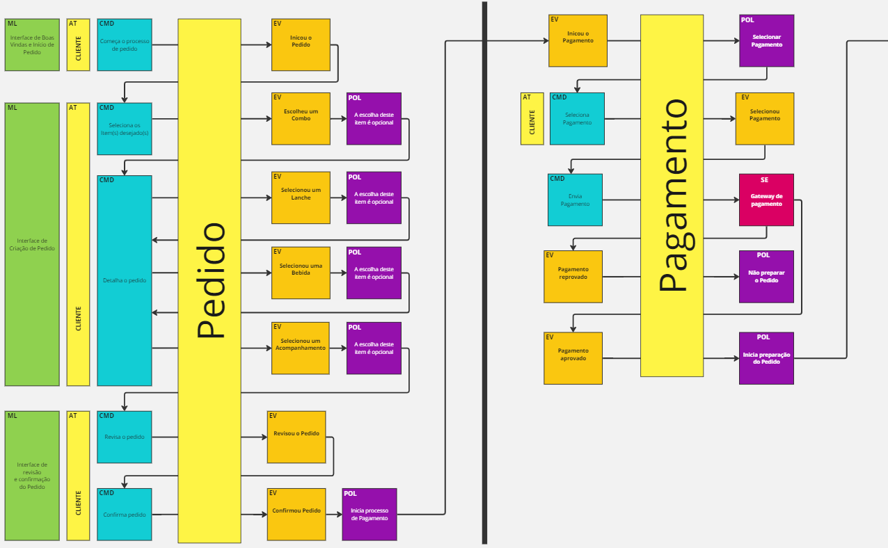

# Tech Challenge - Pós-Tech SOAT - FIAP

Este projeto foi desenvolvido durante o curso de pós-graduação em arquitetura de software da FIAP - turma 5SOAT.

Membros do grupo 32: Armando Ferreira Costa - RM 352815.

# Fase 01

**O PROBLEMA**

Há uma lanchonete de bairro que está expandindo devido seu grande sucesso. Porém, com a expansão e sem um sistema de controle de pedidos, o atendimento aos clientes pode ser caótico e confuso.

Para solucionar o problema, a lanchonete irá investir em um sistema de autoatendimento de fast food, que é composto por uma série de dispositivos e interfaces que permitem aos clientes selecionar e fazer pedidos sem precisar interagir com um atendente.                      

**Entregáveis da fase:**

## Entregável 01

Documentação do sistema (DDD)

**Linguagem Ubíqua:**
|Termo           |Descrição|
|----------------|-------------------------------|
|Cliente |pessoa que faz o pedido e que paga por ele.|
|Produto |item comercializado pela lanchonete, podendo ser classificado pelas categorias.|
|Categoria |categoria de produto, que pode ser - lanche, acompanhamento, bebida ou sobremesa.|
|Pedido |contém os produtos  com as quantidades, que o cliente deseja comprar.|
|Lanche |consumível principal. O sanduíche, que significa "um conjunto de dois pedaços de pão envolvendo um recheio como frios, maionese, queijo, carne etc".|
|Acompanhamento |todo e qualquer consumível que geralmente acompanha o lanche, tal como batata frita ou nugget.|
|Bebida |todo e qualquer consumível líquido, tal como Água, Refrigerante, Suco, Cerveja e afins, que possam ser comprados para consumo.|
|Combo |combinados de Lanche, Bebida e Acompanhamento, que juntos formam um produto novo. Alguns itens podem ser intercambiáveis, por exemplo, trocar um suco por um refrigerante ou uma batata por um nugget.|
|Cozinha |local em que os itens do pedido serão preparados|
 
**Fluxos:**

Miro: [https://miro.com/app/board/uXjVN0RKMb4=/?share_link_id=784435112003](https://miro.com/app/board/uXjVN0RKMb4=/?share_link_id=784435112003)

**a. Realização do pedido e pagamento**


**b. Preparação e entrega do pedido**


## Entregável 02

Repositório: [https://github.com/armandofc1/tech-challenge](https://github.com/armandofc1/tech-challenge)

Aplicação backend (monolito) :

a. Utilizando arquitetura hexagonal

b. APIs
```
I. Cadastro do Cliente
II. Identificação do Cliente via CPF
III. Criar, editar e remover de produto
IV. Buscar produtos por categoria
V. Fake checkout, apenas enviar os produtos escolhidos para a fila
VI. Listar os pedidos
```
c. Aplicação deverá ser escalável para atender grandes volumes nos horários de pico

d. Banco de dados a sua escolha
```
I. Inicialmente deveremos trabalhar e organizar a fila dos pedidos apenas em banco de dados
```

## Entregável 03

Aplicação entregue com um Dockerfile.

Para validação da POC, temos a seguinte limitação de infraestrutura:
- 1 instância para banco de dados
- 1 instâncias para executar aplicação

**Dockerfile**
```
FROM xxxx
VOLUME xxxx
ADD xxxx
RUN xxx
EXPOSE
```
